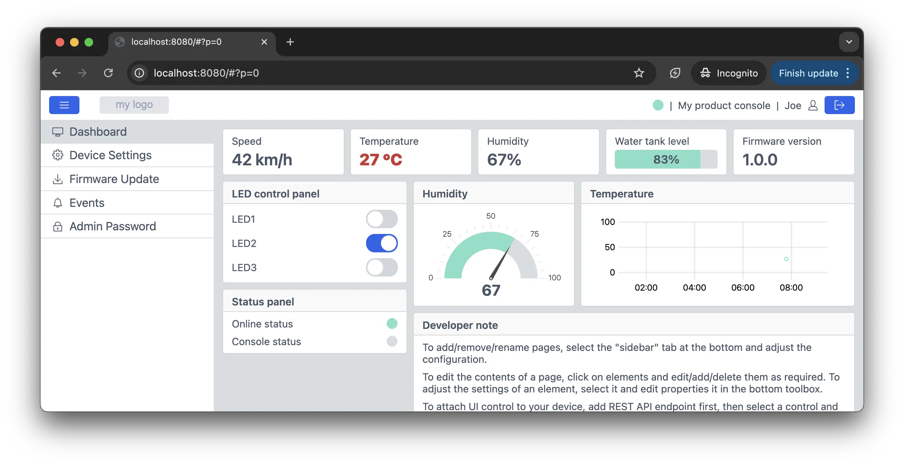

# STM32 Mongoose TCP/IP

This repository contains example Mongoose projects for various STM32 development boards.
[Mongoose](https://mongoose.ws/) is a networking library which includes built-in TCP/IP stack, TLS, HTTP, WebSocket, MQTT and firmware updates. Mongoose is a lightweight, 2-file alternative to lwIP or NetX, which is extremely easy to use in either bare metal or under any RTOS.

Every board has two direcotories containing projects for different build systems:

```text
BOARD-NAME/
          make/       <--- make+GCC: minimal, pure CMSIS
          cubemx/     <--- CubeMX: Vscode or CubeIDE
```

All projects implement the same core functionality: a professional Web UI dashboard with LED control and OTA firmware update. The functionality is identical across all variants and is built using the [Web UI Builder](https://mongoose.ws/wizard/). To customize the dashboard for your production firmware, open `desktop/mongoose/mongoose_wizard.json` in the Web UI Builder, make the required changes, and regenerate the code. No frontend or networking expertise is required.

<div align="center">
  
</div>


The `make` project is the most minimal bare-metal implementation. It uses only Mongoose and CMSIS headers and no external frameworks or vendor libraries. It includes lightweight `hal.c` / `hal.h` implemented directly on top of CMSIS. Best suited for understanding low-level
integration, and production firmware with full control over the stack. In order to build
these projects on your workstation, [set up your build environment](https://mongoose.ws/docs/getting-started/build-environment/).

The `cubemx` project provides STM32CubeMX-based setup. It includes a `.ioc` configuration file, and comes with integration instructions in README.md . Workflow:
1. Open the `.ioc` file in STM32CubeMX  
2. Generate a project (VS Code, CubeIDE, or any IDE)  
3. Follow the README to integrate Mongoose
